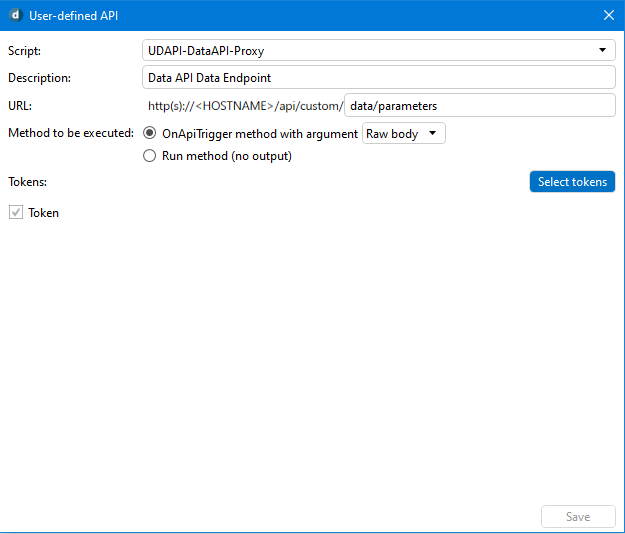
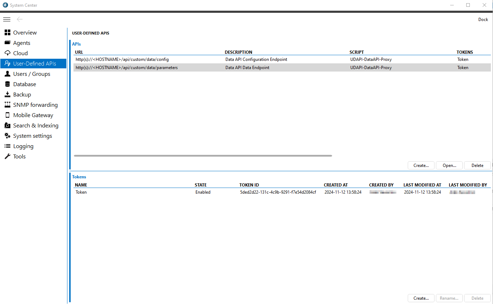
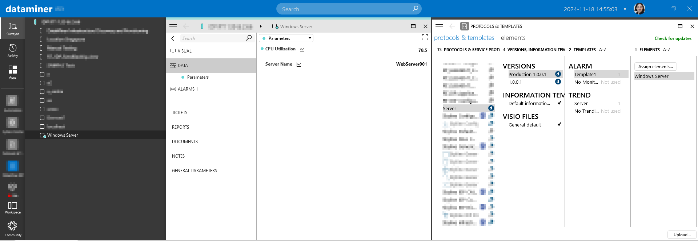

# UDAPI-DataAPI-Proxy

## A Proxy to Access Data API Externally

[DataMiner Data API](https://docs.dataminer.services/user-guide/Advanced_Modules/Data_Sources/Data_API.html) is solution currently in [soft-launch](https://community.dataminer.services/scripted-connectors-are-here/) that offers flexible access to data from any source imaginable, across hardware, software, and cloud services. Enabling automated creation and modification of custom elements using raw values sent via JSON data.

This data is directly reflected in the element, and it can be easily updated using the same API, eliminating the need to develop a connector.

Currently, Data API is limited to only accept local request, most commonly through [Scripted Connectors](https://docs.dataminer.services/user-guide/Advanced_Modules/Data_Sources/Scripted_Connectors.html).

This [User-Defined API](https://docs.dataminer.services/user-guide/Advanced_Modules/User-Defined_APIs/UD_APIs.html) offers a proof-of-concept solution for remote access, functioning as a secure reverse proxy to enable external interaction with Data API.

This documentation explains how you can set up and use the **UDAPI-DataAPI-Proxy** to extend **Data API** functionality beyond the local DataMiner instance.

## Prerequisites

- DataMiner 10.4.2 or higher
- Cloud connected agent with this User Defined API deployed to

## Setting up the Proxy Script

### Deploy the User Defined API

Deploy from the catalog the script onto your (cloud-enabled) DataMiner system. For full details see: [User-Defined APIs - Managing APIs and tokens in DataMiner Cube | DataMiner Docs](https://docs.dataminer.services/user-guide/Advanced_Modules/User-Defined_APIs/UD_APIs_Viewing_in_Cube.html)

### Configure User Defined API

1. Configure the User Defined API to expose Data API as an external API interface with endpoints `data/parameters` and `data/config`
1. Use **Raw body** for method execution.
1. Secure the API with an API token.





### Use Data API via the Proxy

Use an HTTP client (e.g., [Postman](https://www.postman.com/)) to send data to Data API via the Proxy.

For this example, the endpoint `/api/custom/data/parameters` with the HTTP Verb **PUT** will be used to send data to DataMiner and automatically create an element and any HTTP client can be used to send data to Data API via the Proxy (e.g., [Postman](https://www.postman.com/)).

1. Add URL Encoded Parameters

   When pushing data to DataMiner, you need to provide two URL parameters `identifier` and `type`.

   > [!IMPORTANT]
   > This is different that interacting directly with Data API where the `identifier` and `type` should be provided as HTTP Headers and not as URL parameters.

   - `identifier`: A unique identifier (e.g., `DataAPI Test Element 1`). This will be used as the name of the new element.
   - `type`: The type of the auto-generated connector (e.g., `Skyline DataAPI Test Protocol`).

   > [!TIP]
   > Each element requires a unique `identifier`, but they can share a `type`.
   > Elements that share a `type` will share the same parameters and layout, but can still have distinct data.

1. Configure JSON in the Body
   The JSON with the parameter data used in this example:

   ```json
   {
     "Server Name": "WebServer001",
     "CPU Utilization": 78.5
   }
   ```

1. **Configure the Bearer Token**

   In Postman, or your HTTP client of choice, configure the **Bearer Token**, in Postman located on the **Authorization tab**, you previously got from [Configure User Defined API](#configure-user-defined-api).

1. **Send the Request**  

   Send the PUT request and the result will indicate whether the operation was successful (*200 OK*), or provide feedback in case of failure.

### Result

After executing the command:

- A new element should appear in your DataMiner system.
- Every update you send afterward will instantly be reflected in your new element.



The element will be associated with an auto-generated *connector* which will be present in the **Protocols and Templates** module. In there you can configure alarm thresholds and trending to manage the received data.
